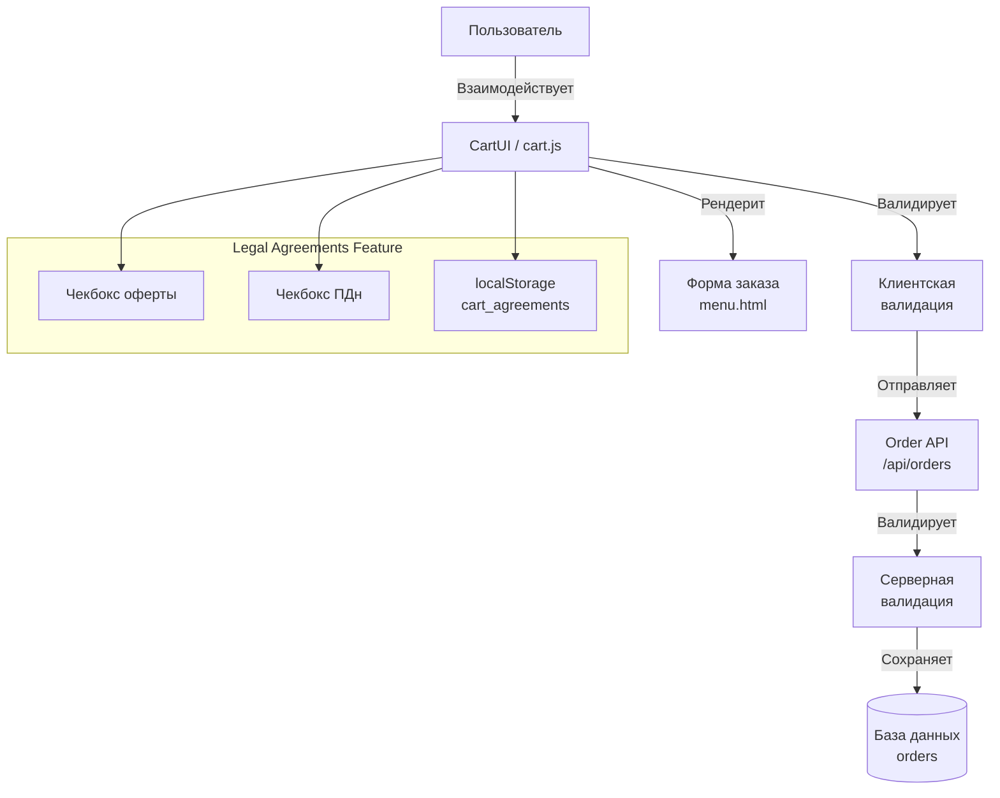

# Дизайн: Оферта и согласие на обработку персональных данных в корзине

## Обзор

Данный документ описывает дизайн реализации функции обязательных юридических согласий в корзине ресторана Molo (molobistro.ru). Функция добавляет в форму оформления заказа два чекбокса: согласие с офертой и согласие на обработку персональных данных (ПДн). Пользователь обязан подтвердить оба согласия перед отправкой заказа.

## Архитектура

### Высокоуровневая архитектура



### Поток данных

1. При открытии формы заказа CartUI проверяет сохранённые согласия в localStorage
2. Пользователь отмечает чекбоксы, состояние сохраняется в localStorage
3. При нажатии «Оформить заказ» клиентская валидация проверяет согласия
4. При успешной валидации данные отправляются на сервер
5. Серверная валидация повторно проверяет согласия
6. При успешной серверной валидации заказ сохраняется с флагами согласий

## Компоненты и интерфейсы

### Клиентская часть (CartUI)

#### Изменения в cart.js

| Компонент | Изменение |
|-----------|-----------|
| `_renderModal()` | Добавление чекбоксов в форму заказа |
| `_submitOrder()` | Добавление валидации согласий |
| `_saveToStorage()` | Сохранение состояния чекбоксов |
| `_loadFromStorage()` | Загрузка состояния чекбоксов |
| `clear()` | Сброс состояния чекбоксов при очистке корзины |

#### Новые функции

```javascript
// Состояние согласий
let _agreements = {
  offer_accepted: false,
  pdpa_consent: false
};

// Валидация согласий перед отправкой
function _validateAgreements() {
  const offerCheckbox = document.getElementById('order-offer-accepted');
  const pdpaCheckbox = document.getElementById('order-pdpa-consent');
  
  const offerError = document.getElementById('order-offer-error');
  const pdpaError = document.getElementById('order-pdpa-error');
  
  let valid = true;
  
  // Сброс ошибок
  if (offerError) { offerError.textContent = ''; offerError.style.display = 'none'; }
  if (pdpaError) { pdpaError.textContent = ''; pdpaError.style.display = 'none'; }
  
  // Проверка оферты
  if (!offerCheckbox || !offerCheckbox.checked) {
    if (offerError) {
      offerError.textContent = 'Необходимо согласиться с офертой';
      offerError.style.display = 'block';
    }
    valid = false;
  }
  
  // Проверка согласия на ПДн
  if (!pdpaCheckbox || !pdpaCheckbox.checked) {
    if (pdpaError) {
      pdpaError.textContent = 'Необходимо согласиться на обработку персональных данных';
      pdpaError.style.display = 'block';
    }
    valid = false;
  }
  
  return valid;
}

// Сохранение согласий в localStorage
function _saveAgreements() {
  const offerCheckbox = document.getElementById('order-offer-accepted');
  const pdpaCheckbox = document.getElementById('order-pdpa-consent');
  
  if (offerCheckbox) _agreements.offer_accepted = offerCheckbox.checked;
  if (pdpaCheckbox) _agreements.pdpa_consent = pdpaCheckbox.checked;
  
  try {
    localStorage.setItem('molo_cart_agreements', JSON.stringify(_agreements));
  } catch (e) {
    // ignore
  }
}

// Загрузка согласий из localStorage
function _loadAgreements() {
  try {
    const raw = localStorage.getItem('molo_cart_agreements');
    if (raw) {
      _agreements = JSON.parse(raw);
    }
  } catch (e) {
    _agreements = { offer_accepted: false, pdpa_consent: false };
  }
}

// Восстановление чекбоксов при открытии формы
function _restoreAgreements() {
  const offerCheckbox = document.getElementById('order-offer-accepted');
  const pdpaCheckbox = document.getElementById('order-pdpa-consent');
  
  if (offerCheckbox) offerCheckbox.checked = _agreements.offer_accepted;
  if (pdpaCheckbox) pdpaCheckbox.checked = _agreements.pdpa_consent;
}

// Сброс согласий
function _resetAgreements() {
  _agreements = { offer_accepted: false, pdpa_consent: false };
  try {
    localStorage.removeItem('molo_cart_agreements');
  } catch (e) {
    // ignore
  }
}
```

#### HTML-шаблон чекбоксов (добавление в menu.html)

```html
<!-- Чекбоксы согласий, перед кнопкой "Оформить заказ" -->
<div class="cart-form-field cart-legal-agreements">
  <div class="agreement-checkbox">
    <input type="checkbox" id="order-offer-accepted" name="offer_accepted" />
    <label for="order-offer-accepted">
      Я согласен с <a href="/offer.html" target="_blank">условиями оферты</a>
    </label>
    <span class="field-error" id="order-offer-error" style="display:none;"></span>
  </div>
  <div class="agreement-checkbox">
    <input type="checkbox" id="order-pdpa-consent" name="pdpa_consent" />
    <label for="order-pdpa-consent">
      Я согласен на <a href="/privacy.html" target="_blank">обработку персональных данных</a>
    </label>
    <span class="field-error" id="order-pdpa-error" style="display:none;"></span>
  </div>
</div>
```

#### Изменения в CSS

```css
.cart-legal-agreements {
  margin-bottom: 16px;
}

.agreement-checkbox {
  display: flex;
  align-items: flex-start;
  gap: 8px;
  margin-bottom: 12px;
}

.agreement-checkbox input[type="checkbox"] {
  margin-top: 3px;
  flex-shrink: 0;
}

.agreement-checkbox label {
  font-size: 14px;
  line-height: 1.4;
  color: #333;
}

.agreement-checkbox label a {
  color: #0066cc;
  text-decoration: underline;
}

.agreement-checkbox label a:hover {
  text-decoration: none;
}

.cart-legal-agreements .field-error {
  display: block;
  color: #d32f2f;
  font-size: 12px;
  margin-top: 4px;
  margin-left: 20px;
}
```

### Серверная часть (server.js)

#### Изменения в POST /api/orders

| Параметр | Тип | Обязательный | Описание |
|----------|-----|--------------|----------|
| `offer_accepted` | boolean | Да | Подтверждение согласия с офертой |
| `pdpa_consent` | boolean | Да | Согласие на обработку ПДн |

#### Валидация на сервере

```javascript
// Добавление в начало обработчика POST /api/orders
const { offer_accepted, pdpa_consent } = req.body;

// Валидация согласия с офертой
if (!offer_accepted || offer_accepted !== true) {
  return res.status(400).json({ 
    error: 'Необходимо согласиться с офертой',
    field: 'offer_accepted'
  });
}

// Валидация согласия на обработку ПДн
if (!pdpa_consent || pdpa_consent !== true) {
  return res.status(400).json({ 
    error: 'Необходимо согласиться на обработку персональных данных',
    field: 'pdpa_consent'
  });
}
```

#### Сохранение в базу данных

```sql
-- Добавление колонок в таблицу orders
ALTER TABLE orders ADD COLUMN offer_accepted BOOLEAN DEFAULT FALSE;
ALTER TABLE orders ADD COLUMN pdpa_consent BOOLEAN DEFAULT FALSE;
```

```javascript
// Добавление в INSERT запрос
const { rows } = await pool.query(
  `INSERT INTO orders (
    customer_name, customer_phone, customer_email, items, total_amount,
    delivery_type, delivery_address, delivery_time, pickup_time, delivery_comment,
    items_count, order_number, tableware_count, payment_method,
    delivery_cost, offer_accepted, pdpa_consent
  ) VALUES ($1, $2, $3, $4, $5, $6, $7, $8, $9, $10, $11, $12, $13, $14, $15, $16, $17) RETURNING *`,
  [
    // ... существующие поля ...
    offer_accepted,
    pdpa_consent
  ]
);
```

## Модели данных

### Клиентская модель (localStorage)

```typescript
interface CartAgreements {
  offer_accepted: boolean;   // Согласие с офертой
  pdpa_consent: boolean;     // Согласие на обработку ПДн
}
```

### Серверная модель (база данных)

```sql
-- Таблица orders (расширенная)
CREATE TABLE orders (
  id SERIAL PRIMARY KEY,
  customer_name VARCHAR(255) NOT NULL,
  customer_phone VARCHAR(50) NOT NULL,
  customer_email VARCHAR(255),
  items JSONB NOT NULL,
  total_amount DECIMAL(10,2) NOT NULL,
  delivery_type VARCHAR(20) DEFAULT 'self',
  delivery_address TEXT,
  delivery_time VARCHAR(100),
  pickup_time VARCHAR(100),
  delivery_comment TEXT,
  items_count INTEGER DEFAULT 0,
  order_number VARCHAR(20) UNIQUE NOT NULL,
  tableware_count INTEGER DEFAULT 1,
  payment_method VARCHAR(20),
  delivery_cost DECIMAL(10,2) DEFAULT 0,
  -- Новые поля
  offer_accepted BOOLEAN DEFAULT FALSE,
  pdpa_consent BOOLEAN DEFAULT FALSE,
  -- Системные поля
  status VARCHAR(50) DEFAULT 'pending',
  created_at TIMESTAMP DEFAULT CURRENT_TIMESTAMP,
  updated_at TIMESTAMP DEFAULT CURRENT_TIMESTAMP
);
```

### API request/response

```typescript
// POST /api/orders Request Body
interface CreateOrderRequest {
  customer_name: string;
  customer_phone: string;
  customer_email?: string;
  items: OrderItem[];
  total_amount: number;
  delivery_type: 'self' | 'courier';
  delivery_address?: string;
  delivery_time?: string;
  pickup_time?: string;
  delivery_comment?: string;
  tableware_count?: number;
  payment_method?: 'cash' | 'online';
  delivery_cost?: number;
  // Обязательные поля согласий
  offer_accepted: true;
  pdpa_consent: true;
}

// Error Response (400)
interface ValidationErrorResponse {
  error: string;
  field?: string;
}
```

## Корректность

### Свойства корректности

*A property is a characteristic or behavior that should hold true across all valid executions of a system-essentially, a formal statement about what the system should do. Properties serve as the bridge between human-readable specifications and machine-verifiable correctness guarantees.*

#### Property 1: Клиентская валидация оферты

*Для любого* состояния формы заказа, когда пользователь нажимает кнопку «Оформить заказ» без отметки чекбокса оферты, система **должна** отображать сообщение об ошибке и **не должна** отправлять данные на сервер.

**Validates: Requirements 1.4, 3.1**

#### Property 2: Клиентская валидация согласия на ПДн

*Для любого* состояния формы заказа, когда пользователь нажимает кнопку «Оформить заказ» без отметки чекбокса согласия на ПДн, система **должна** отображать сообщение об ошибке и **не должна** отправлять данные на сервер.

**Validates: Requirements 2.4, 3.2**

#### Property 3: Серверная валидация оферты

*Для любого* входящего запроса на создание заказа, если `offer_accepted` отсутствует или равен `false`, сервер **должен** возвращать HTTP 400 с описанием ошибки.

**Validates: Requirements 5.1**

#### Property 4: Серверная валидация согласия на ПДн

*Для любого* входящего запроса на создание заказа, если `pdpa_consent` отсутствует или равен `false`, сервер **должен** возвращать HTTP 400 с описанием ошибки.

**Validates: Requirements 5.2**

#### Property 5: Сохранение согласий в заказе

*Для любого* успешно созданного заказа, значения полей `offer_accepted` и `pdpa_consent` **должны** быть сохранены в базе данных и соответствовать значениям, переданным в запросе.

**Validates: Requirements 5.3**

#### Property 6: Сохранение состояния чекбоксов между переходами

*Для любого* пользователя, который отметил чекбоксы, закрыл форму и повторно её открыл, состояние чекбоксов **должно** быть восстановлено из localStorage.

**Validates: Requirements 4.1, 4.2**

#### Property 7: Сброс согласий при очистке корзины

*Для любого* пользователя, который очищает корзину, состояние чекбоксов согласий **должно** быть сброшено в localStorage.

**Validates: Requirements 4.3**

## Обработка ошибок

### Клиентские ошибки

| Код | Сообщение | Действие |
|-----|-----------|----------|
| OFFER_REQUIRED | Необходимо согласиться с офертой | Показать под полем оферты |
| PDPA_REQUIRED | Необходимо согласиться на обработку персональных данных | Показать под полем ПДн |

### Серверные ошибки

| Код | HTTP | Сообщение |
|-----|------|-----------|
| OFFER_NOT_ACCEPTED | 400 | Необходимо согласиться с офертой |
| PDPA_NOT_CONSENTED | 400 | Необходимо согласиться на обработку персональных данных |
| VALIDATION_ERROR | 400 | Общая ошибка валидации |

### User Experience при ошибках

1. При ошибке валидации фокус не перемещается автоматически
2. Сообщения об ошибках отображаются непосредственно под соответствующим чекбоксом
3. Кнопка «Оформить заказ» остаётся активной (не disabled), чтобы пользователь мог повторить попытку
4. При успешной валидации сообщения об ошибках скрываются

## Стратегия тестирования

### Обоснование подхода к тестированию

Данная функция включает как клиентскую логику (валидация согласий), так и серверную (API валидация). Учитывая наличие логики с входными параметрами, для части требований применимо property-based тестирование.

### Unit-тесты

**Применимость:** Не все критерии приёмки требуют PBT. Для UI-компонентов и взаимодействия с DOM используются unit-тесты.

- Тест рендеринга чекбоксов в форму
- Тест привязки label к input через for атрибут
- Тест атрибута target="_blank" для ссылок
- Тест порядка чекбоксов (офера → ПДн)
- Тест CSS-стилей чекбоксов

### Property-based тесты

**Применимость:** Для валидационной логики на клиенте и сервере.

| Библиотека | Язык |
|------------|------|
| fast-check | JavaScript/Node.js |

#### Конфигурация

- Минимальное количество итераций: 100
- Теги: `Feature: cart-legal-agreements, Property N: <описание>`

#### Примеры property-тестов

```javascript
// Property 1: Клиентская валидация оферты
// Feature: cart-legal-agreements, Property 1: Offer validation

test('offer checkbox must be checked to submit order', () => {
  fc.assert(
    fc.property(fc.boolean(), (offerChecked) => {
      // Setup: render form with offer checkbox
      const form = renderOrderForm();
      const offerCheckbox = document.getElementById('order-offer-accepted');
      offerCheckbox.checked = offerChecked;
      
      // Execute: attempt to submit
      const canSubmit = validateForm();
      
      // Assert: can submit only if offer is checked
      expect(canSubmit).toBe(offerChecked);
    }),
    { numRuns: 100 }
  );
});

// Property 3: Серверная валидация оферты
// Feature: cart-legal-agreements, Property 3: Server offer validation

test('server rejects order without offer acceptance', () => {
  fc.assert(
    fc.property(fc.oneOf(fc.boolean(), fc.constantFrom(undefined, null)), (offerValue) => {
      // Skip if valid (true)
      if (offerValue === true) return;
      
      // Execute: send order without valid offer
      const response = await sendOrder({ 
        offer_accepted: offerValue,
        pdpa_consent: true,
        // ... other required fields
      });
      
      // Assert: server must reject
      expect(response.status).toBe(400);
      expect(response.body.error).toContain('оферт');
    }),
    { numRuns: 100 }
  );
});
```

### Интеграционные тесты

- E2E тест полного flow оформления заказа с согласиями
- Тест сохранения согласий в localStorage
- Тест сброса согласий при очистке корзины
- Тест серверного сохранения флагов согласий в БД

### Тестирование Edge Cases

| Edge Case | Тип теста |
|-----------|-----------|
| Отправка формы с отключённым JS | Интеграция |
| localStorage недоступен | Unit |
| Косые кавычки в тексте ошибки | Unit |
| Множественные попытки отправки | Интеграция |
| Переключение языка (если поддерживается) | Не требуется |

### График тестирования

1. **До реализации:** Property-тесты для валидационной логики
2. **После реализации:** Unit-тесты для UI, интеграционные тесты
3. **Регрессия:** Существующие тесты корзины и заказов