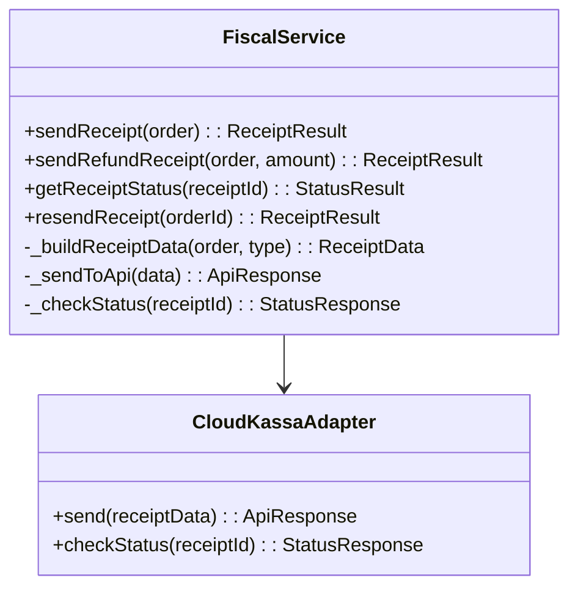

# Дизайн: Фискализация (54-ФЗ)

## Overview

Технический дизайн интеграции с облачной онлайн-кассой для формирования и отправки фискальных чеков в соответствии с 54-ФЗ.

---

## Architecture

### High-Level System Diagram

```mermaid
flowchart TD
    subgraph Client ["Клиент (Browser)"]
        OrderForm[Форма заказа]
        AdminPanel[Админ-панель]
    end

    subgraph Server ["Сервер (Express.js)"]
        OrderAPI[OrderAPI]
        PaymentService[PaymentService]
        FiscalService[FiscalService]
        NotificationService[NotificationService]
    end

    subgraph External ["Внешние системы"]
        TochkaAPI[ТОЧКА.БАНК]
        CloudKassa[Облачная касса]
        EmailService[Email]
    end

    PaymentService -->|Webhook: paid| FiscalService
    FiscalService -->|Чек (54-ФЗ)| CloudKassa
    FiscalService -->|Email с чеком| EmailService
    AdminPanel -->|Ручная отправка| FiscalService
```

### Component Diagram



---

## Data Models

### Receipt Data (54-ФЗ)

```javascript
// Структура чека для облачной кассы
{
  // Продавец
  seller: {
    inn: "1234567890",           // ИНН организации
    name: 'ООО "Ресторан Моло"', // Название
    address: "г. Москва, ул. Примерная, д. 1"  // Адрес
  },
  
  // Чек
  receipt: {
    // Позиции
    items: [
      {
        name: "Название блюда",
        quantity: 2,              // Количество
        price: 59000,             // Цена в копейках за единицу
        total: 118000,            // Сумма (price * quantity)
        vat: "none" | "vat10" | "vat20"  // Ставка НДС
      }
    ],
    
    // Итого
    totals: {
      discount: 0,
      total: 138000               // Итого к оплате в копейках
    },
    
    // Оплата
    payments: [
      {
        type: "online",           // Тип оплаты
        amount: 138000            // Сумма оплаты
      }
    ],
    
    // Компания
    company: {
      inn: "1234567890",
      email: "client@example.com" // Email для отправки чека
    }
  },
  
  // Идентификатор
  external_id: "order_42",        // ID заказа в системе
  
  // Служебное
  service: {
    callback_url: "https://site.com/api/fiscal/callback"
  }
}
```

### Receipt Response

```javascript
{
  success: true,
  receiptId: "receipt_abc123",    // ID чека в облачной кассе
  receiptUrl: "https://check.cloudkassa.ru/abc123"  // Ссылка на чек
}
```

### Order с фискальными данными

```javascript
{
  id: 42,
  // ... существующие поля
  
  // Фискальные данные
  receipt_id: "receipt_abc123",
  receipt_url: "https://check.cloudkassa.ru/abc123",
  fiscal_status: "pending" | "sent" | "completed" | "error",
  fiscal_error: null | "Текст ошибки"
}
```

---

## Supported Providers

### CloudKassir (Рекомендуемый)

| Параметр | Значение |
|----------|----------|
| API URL | `https://api.cloudkassir.ru` |
| Тип | REST API |
| Особенности | Простая интеграция, поддержка всех типов чеков |

### МойСклад

| Параметр | Значение |
|----------|----------|
| API URL | `https://online.moysklad.ru/api/remap/1.2` |
| Тип | REST API |
| Особенности | Требует создания номенклатуры |

### Эвотор

| Параметр | Значение |
|----------|----------|
| API URL | `https://evotor.ru/api/v1` |
| Тип | REST API |
| Особенности | Требует регистрации в Эвотор |

---

## API Endpoints

### Существующие (расширение)

| Метод | Путь | Описание |
|-------|------|----------|
| POST | /api/payment/webhook | При оплате → автоматический чек |

### Новые

| Метод | Путь | Описание |
|-------|------|----------|
| POST | /api/fiscal/send/:orderId | Ручная отправка чека |
| GET | /api/fiscal/status/:orderId | Проверить статус чека |
| POST | /api/fiscal/callback | Callback от ПКФ |

---

## Implementation

### Расширение FiscalService (server.js)

```javascript
const FiscalService = {
  // Отправить чек (существующий метод, расширить)
  async sendReceipt(order) { ... },
  
  // Отправить чек возврата
  async sendRefundReceipt(order, refundAmount) { ... },
  
  // Проверить статус чека
  async getReceiptStatus(receiptId) { ... },
  
  // Повторно отправить чек
  async resendReceipt(orderId) {
    const order = await getOrderById(orderId);
    return this.sendReceipt(order);
  },
  
  // Callback от ПКФ
  async handleCallback(payload) {
    const { external_id, status, error } = payload;
    // external_id = "order_{orderId}"
    await updateOrderFiscalStatus(orderId, status, error);
  }
};
```

### API эндпоинты

```javascript
// POST /api/fiscal/send/:orderId
app.post('/api/fiscal/send/:orderId', adminAuth, async (req, res) => {
  const result = await FiscalService.resendReceipt(orderId);
  res.json(result);
});

// GET /api/fiscal/status/:orderId
app.get('/api/fiscal/status/:orderId', adminAuth, async (req, res) => {
  const order = await getOrderById(orderId);
  if (!order.receipt_id) {
    return res.json({ status: 'not_sent' });
  }
  const result = await FiscalService.getReceiptStatus(order.receipt_id);
  res.json(result);
});

// POST /api/fiscal/callback
app.post('/api/fiscal/callback', async (req, res) => {
  await FiscalService.handleCallback(req.body);
  res.json({ ok: true });
});
```

### Email отправка чека

```javascript
// В FiscalService.sendReceipt после успешного ответа:
if (order.customer_email) {
  await NotificationService.sendCustomerReceipt({
    orderId: order.id,
    email: order.customer_email,
    receiptUrl: result.receiptUrl
  });
}
```

---

## UI Changes (Админ-панель)

### Детали заказа — секция чека

```html
<div class="order-detail-row">
  <span>Чек</span>
  <div>
    <span class="fiscal-status fiscal-status-{status}">{statusText}</span>
    <a href="{receipt_url}" target="_blank">Открыть чек</a>
  </div>
</div>

<!-- Кнопка повторной отправки при ошибке -->
<button onclick="resendReceipt({orderId})" class="btn-primary">
  Повторить отправку
</button>
```

### CSS стили

```css
.fiscal-status { padding: 4px 10px; border-radius: 999px; font-size: 11px; font-weight: 700; }
.fiscal-status-pending { background: #fef3c7; color: #92400e; }
.fiscal-status-sent { background: #dbeafe; color: #1e40af; }
.fiscal-status-completed { background: #d1fae5; color: #065f46; }
.fiscal-status-error { background: #fee2e2; color: #991b1b; }
```

---

## Configuration

### Environment Variables

```bash
# Обязательные
FISCAL_INN=1234567890                    # ИНН организации
FISCAL_NAME='ООО "Ресторан Моло"'         # Название
FISCAL_ADDRESS='г. Москва, ул. x, д. y'   # Адрес точки

# API провайдера (пример для CloudKassir)
FISCAL_API_URL=https://api.cloudkassir.ru
FISCAL_API_KEY=your_api_key_here
FISCAL_CALLBACK_URL=https://molobistro.ru/api/fiscal/callback

# Опционально
FISCAL_COMPANY_EMAIL=admin@molobistro.ru  # Email для уведомлений
```

---

## Error Handling

### Типы ошибок

| Код | Описание | Действие |
|-----|----------|----------|
| AUTH_ERROR | Неверный API ключ | Уведомить админа |
| VALIDATION_ERROR | Неверные данные чека | Логировать, не повторять |
| NETWORK_ERROR | Сеть недоступна | Повторить 3 раза |
| FISCAL_ERROR | Ошибка ФНС | Уведомить админа |

### Retry Logic

```javascript
async function sendWithRetry(receiptData, maxRetries = 3) {
  for (let i = 0; i < maxRetries; i++) {
    try {
      return await this._sendToApi(receiptData);
    } catch (error) {
      if (i === maxRetries - 1) throw error;
      await sleep(Math.pow(2, i) * 1000); // 1s, 2s, 4s
    }
  }
}
```

---

## Acceptance Criteria

1. ✅ При successful payment → чек автоматически отправляется в облачную кассу
2. ✅ Чек содержит все обязательные поля 54-ФЗ
3. ✅ При refund → чек возврата отправляется корректно
4. ✅ Клиент получает чек на email (если указан)
5. ✅ Статус чека отображается в админ-панели
6. ✅ Доступна ручная повторная отправка чека
7. ✅ Ошибки фискализации логируются и отображаются
8. ✅ Callback от ПКФ корректно обрабатывается

---

## Notes

- Использует существующий FiscalService как основу
- Минимальные изменения в server.js (новые эндпоинты)
- Frontend: расширение деталей заказа в админ-панели
- Обратная совместимость с существующими заказами