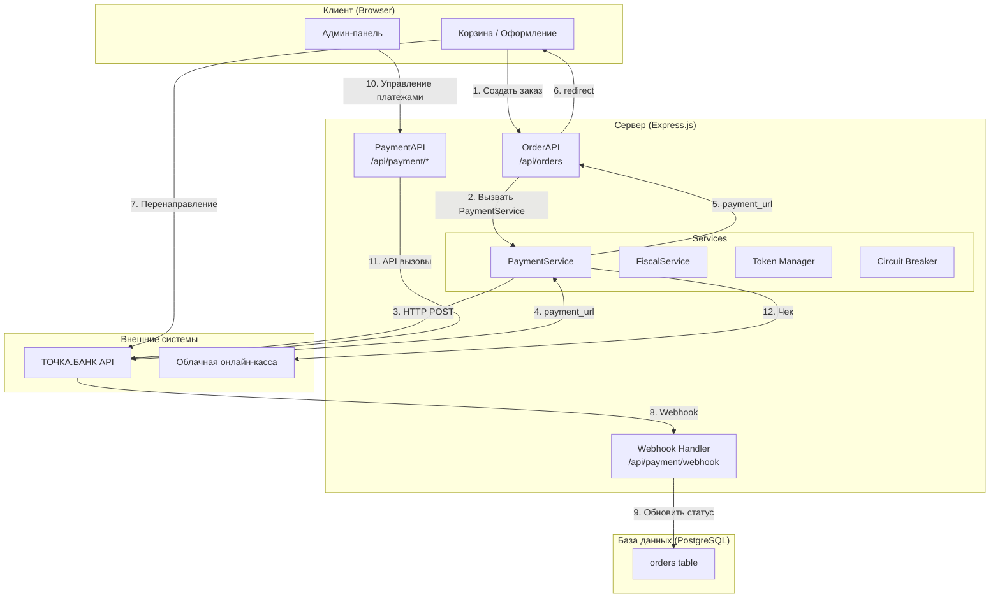
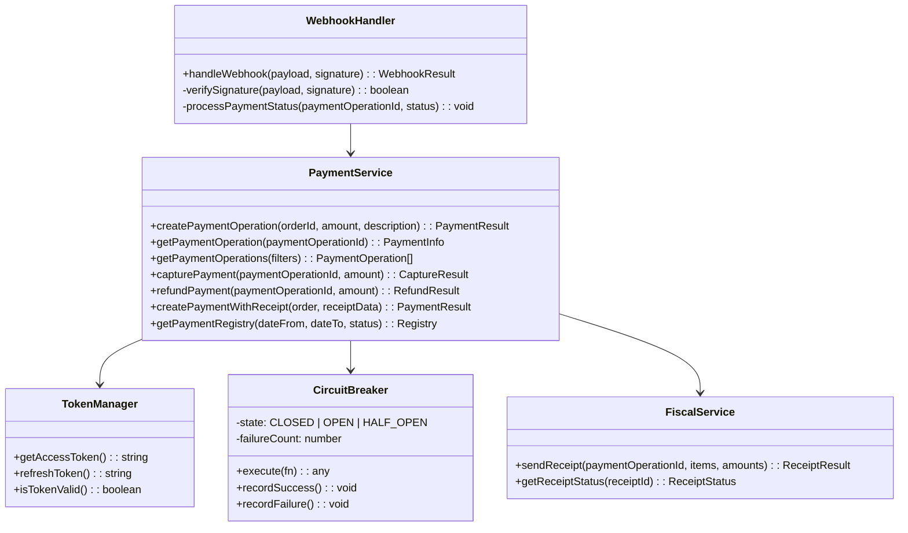
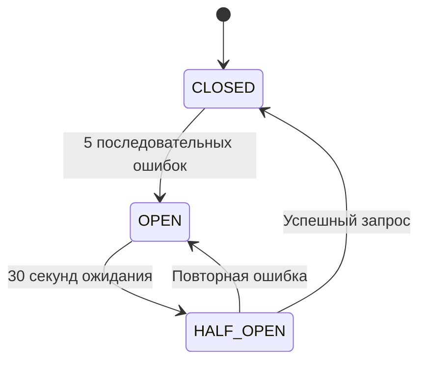

# Дизайн: Интеграция с платёжным API ТОЧКА.БАНК

## Overview

Документ описывает технический дизайн интеграции с платёжным API ТОЧКА.БАНК для сайта ресторана Molo (molobistro.ru). Интеграция обеспечивает приём платежей через СБП (Система Быстрых Платежей) с поддержкой полного цикла платежей: создание, отслеживание статуса, двухэтапное списание (capture), возврат и формирование чеков.

### Цели

- Обеспечить приём онлайн-платежей через СБП
- Реализовать автоматическое обновление статусов заказов через webhook
- Предоставить админ-панель для управления платежами
- Обеспечить соответствие требованиям 54-ФЗ (чеки)

### Scope

- Backend: PaymentService, OrderAPI расширение, FiscalService
- Database: миграция таблицы orders
- Frontend: интеграция с существующей корзиной и админ-панелью

---

## Architecture

### High-Level System Diagram



### Component Diagram



---

## Components and Interfaces

### PaymentService

Основной сервис для работы с API ТОЧКА.БАНК.

```typescript
interface PaymentServiceConfig {
  apiEnvironment: 'sandbox' | 'production';
  clientId: string;
  clientSecret: string;
  refreshToken: string;
  apiTimeout: number;
  maxRetries: number;
}

interface PaymentResult {
  success: boolean;
  paymentOperationId?: string;
  paymentUrl?: string;
  error?: PaymentError;
}

interface PaymentError {
  code: string;
  message: string;
  details?: any;
}

interface PaymentInfo {
  paymentOperationId: string;
  status: PaymentStatus;
  amount: number;
  currency: string;
  createdAt: Date;
  paidAt?: Date;
  paymentMethod?: string;
  payerDetails?: PayerDetails;
  receiptUrl?: string;
}

type PaymentStatus = 'created' | 'authorized' | 'paid' | 'captured' | 'failed' | 'refunded' | 'partial_refunded';

interface PayerDetails {
  phone?: string;
  email?: string;
  name?: string;
}
```

### OrderAPI Endpoints

Расширение существующего API для интеграции с платежами.

```javascript
// POST /api/orders - расширение существующего
// Добавлено: при success=true возвращает payment_url для СБП

// GET /api/payment/operations - получить список операций
// Query: dateFrom, dateTo, status, page, limit
// Response: { operations: PaymentInfo[], total: number, page: number }

// GET /api/payment/operations/:paymentOperationId - детали операции
// Response: PaymentInfo

// POST /api/payment/operations/:paymentOperationId/capture - списание средств
// Body: { amount?: number }  // опционально для partial capture
// Response: { success: boolean, status: string }

// POST /api/payment/operations/:paymentOperationId/refund - возврат
// Body: { amount: number, reason?: string }
// Response: { success: boolean, status: string }

// GET /api/payment/registry - реестр платежей
// Query: dateFrom, dateTo, status
// Response: { registry: RegistryEntry[], totals: { total: number, refunds: number, net: number } }

// POST /api/payment/webhook - webhook от ТОЧКА.БАНК
// Body: { payment_operation_id: string, status: string, timestamp: string }
// Response: { ok: boolean }
```

### Database Schema

Расширение таблицы `orders`:

```sql
ALTER TABLE orders ADD COLUMN IF NOT EXISTS payment_operation_id TEXT;
ALTER TABLE orders ADD COLUMN IF NOT EXISTS payment_status TEXT DEFAULT 'pending';
ALTER TABLE orders ADD COLUMN IF NOT EXISTS captured_at TIMESTAMPTZ;
ALTER TABLE orders ADD COLUMN IF NOT EXISTS refunded_at TIMESTAMPTZ;
ALTER TABLE orders ADD COLUMN IF NOT EXISTS refund_amount REAL DEFAULT 0;
ALTER TABLE orders ADD COLUMN IF NOT EXISTS fiscal_receipt_url TEXT;
```

---

## Data Models

### Order Model (расширенный)

```typescript
interface Order {
  id: number;
  customerName: string;
  customerPhone: string;
  customerEmail?: string;
  items: CartItem[];
  totalAmount: number;
  pickupType: 'self' | 'delivery';
  status: OrderStatus;
  paymentUrl?: string;
  createdAt: Date;
  
  // Новые поля для платежей
  paymentOperationId?: string;
  paymentStatus?: PaymentStatus;
  capturedAt?: Date;
  refundedAt?: Date;
  refundAmount?: number;
  fiscalReceiptUrl?: string;
}

type OrderStatus = 'pending' | 'paid' | 'failed' | 'captured' | 'refunded' | 'partial_refunded' | 'cancelled';
```

### Receipt Data Model

```typescript
interface ReceiptData {
  items: ReceiptItem[];
  totalAmount: number;
  vatAmount: number;
  paymentMethod: 'online' | 'cash';
  senderDetails: {
    inn: string;
    name: string;
    address: string;
  };
}

interface ReceiptItem {
  name: string;
  quantity: number;
  price: number;
  vatRate: 'none' | 'vat10' | 'vat20';
  total: number;
}
```

### Registry Entry Model

```typescript
interface RegistryEntry {
  paymentOperationId: string;
  orderId: number;
  date: Date;
  amount: number;
  status: PaymentStatus;
  refundAmount?: number;
}

interface RegistryTotals {
  total: number;
  refunds: number;
  net: number;
}
```

---

## Error Handling

### Error Classification

| Категория | Код | HTTP Status | Описание |
|-----------|-----|-------------|----------|
| Validation | VALIDATION_ERROR | 400 | Неверные параметры запроса |
| Auth | AUTH_ERROR | 401 | Ошибка авторизации (токен истёк) |
| Not Found | NOT_FOUND | 404 | Платёж не найден |
| Business | BUSINESS_ERROR | 400 | Бизнес-логика (недостаточно средств) |
| Network | NETWORK_ERROR | 503 | Временная недоступность API |
| Internal | INTERNAL_ERROR | 500 | Внутренняя ошибка сервера |

### Error Response Format

```json
{
  "error": {
    "code": "VALIDATION_ERROR",
    "message": "Описание ошибки",
    "details": {
      "field": "amount",
      "reason": "Сумма должна быть положительной"
    }
  }
}
```

### Circuit Breaker Behavior



---

## Testing Strategy

### Тестирование компонентов

**Unit Tests:**
- Валидация входных параметров PaymentService
- Генерация подписи для webhook
- Форматирование данных чека
- Обработка ошибок и классификация

**Property-Based Tests:**
- Генерация payment_url из orderId
- Сериализация/десериализация данных платежа
- Инварианты статусов заказа
- Round-trip для receipt data

**Integration Tests:**
- Взаимодействие с API ТОЧКА.БАНК (mock)
- Обработка webhook
- Миграция БД

### Библиотеки для тестирования

- **fast-check**: Property-based тесты
- **supertest**: HTTP интеграционные тесты
- **nock**: Mock HTTP запросов

### Теги для тестов

```
Feature: tochka-payment-integration
Property N: <описание свойства>
Validates: Requirements X.Y
```

---

## Acceptance Criteria Testing Prework

### 1.1. Create Payment Operation
  Thoughts: Создание платежа - это вызов внешнего API. Поведение зависит от структуры заказа и суммы. Можно тестировать генерацию запроса и парсинг ответа.
  Classification: PROPERTY
  Test Strategy: Генерировать случайные заказы с разными суммами, формировать запрос к API, проверять что payment_operation_id и payment_url извлекаются корректно

### 1.2-1.8. API interaction
  Thoughts: Это интеграция с внешним API - тестируем через mock
  Classification: INTEGRATION
  Test Strategy: 2-3 примера для основных сценариев (success, timeout, error)

### 2.1-2.6. Payment List
  Thoughts: Получение списка - это filtering и pagination. Можно тестировать генерацию правильных параметров запроса
  Classification: PROPERTY
  Test Strategy: Генерировать случайные параметры фильтрации, проверять что результат фильтруется правильно

### 3.1-3.5. Payment Info
  Thoughts: Получение деталей платежа - валидация что все поля из API присутствуют в ответе
  Classification: PROPERTY
  Test Strategy: Генерировать случайные ответы API, проверять что все поля маппируются корректно

### 4.1-4.7. Capture Payment
  Thoughts: Capture - это смена статуса заказа. Можно тестировать инвариант: после capture статус заказа = captured
  Classification: PROPERTY
  Test Strategy: Генерировать случайные заказы в статусе authorized, выполнять capture, проверять что статус обновился

### 5.1-5.9. Refund
  Thoughts: Refund - это также смена статуса. Полный refund -> status = refunded, partial -> partial_refunded
  Classification: PROPERTY
  Test Strategy: Генерировать случайные суммы возврата, проверять правильность статуса

### 6.1-6.6. Receipt
  Thoughts: Формирование данных чека - это сериализация данных заказа в формат ФНС
  Classification: PROPERTY
  Test Strategy: Генерировать случайные заказы, формировать чек, проверять round-trip (чек содержит все данные заказа)

### 7.1-7.7. Registry
  Thoughts: Реестр - это агрегация данных. Проверять расчёт итогов (total - refunds = net)
  Classification: PROPERTY
  Test Strategy: Генерировать случайные наборы операций, проверять что итоговые суммы считаются правильно

### 8.1-8.8. Webhook
  Thoughts: Webhook - это интеграция с внешней системой. Проверять верификацию подписи и idempotency
  Classification: INTEGRATION
  Test Strategy: 2-3 примера: валидный webhook, невалидная подпись, дубликат

### 9.1-9.7. Configuration
  Thoughts: Конфигурация - это setup, не тестируется через PBT
  Classification: SMOKE
  Test Strategy: Проверить что сервис запускается с правильной конфигурацией

### 10.1-10.6. Error Handling
  Thoughts: Обработка ошибок - это классификация и логирование
  Classification: EXAMPLE
  Test Strategy: Несколько примеров разных типов ошибок

### 11.1-11.5. Compatibility
  Thoughts: Обратная совместимость - проверять что существующие API работают без изменений
  Classification: INTEGRATION
  Test Strategy: Вызвать существующие endpoints без payment данных

---

## Correctness Properties

*A property is a characteristic or behavior that should hold true across all valid executions of a system—essentially, a formal statement about what the system should do. Properties serve as the bridge between human-readable specifications and machine-verifiable correctness guarantees.*

### Property 1: Payment URL Generation

*For any* positive integer orderId, generating a payment URL should produce a valid URL containing the orderId

**Validates: Requirements 1.5**

### Property 2: Payment Status After Capture

*For any* order in `authorized` status, calling capture should result in the order status changing to `captured` or `paid`

**Validates: Requirements 4.4**

### Property 3: Refund Status Mapping

*For any* refund request, if the refund amount equals the payment amount, the status should be `refunded`; if less, the status should be `partial_refunded`

**Validates: Requirements 5.6**

### Property 4: Receipt Data Completeness

*For any* order with items, the generated receipt should contain all item names, quantities, and prices

**Validates: Requirements 6.2**

### Property 5: Registry Totals Calculation

*For any* list of payment operations, the net amount should equal total amount minus total refunds

**Validates: Requirements 7.5**

### Property 6: Webhook Idempotency

*For any* webhook payload received twice with the same payment_operation_id and status, the order status should only be updated once

**Validates: Requirements 8.8**

### Property 7: Payment Operation Round-Trip

*For any* payment operation data, serializing to JSON and parsing back should produce equivalent data

**Validates: Requirements 1.4**

---

## Implementation Notes

### Конфигурация через Environment Variables

```bash
# ТОЧКА.БАНК
TOCHKA_API_ENV=sandbox  # или production
TOCHKA_CLIENT_ID=your_client_id
TOCHKA_CLIENT_SECRET=your_client_secret
TOCHKA_REFRESH_TOKEN=your_refresh_token

# Для боевого режима
# TOCHKA_API_ENV=production
# TOCHKA_API_URL=https://enter.tochka.com
```

### Retry Logic

```javascript
async function withRetry(fn, maxRetries = 3) {
  let lastError;
  for (let i = 0; i < maxRetries; i++) {
    try {
      return await fn();
    } catch (error) {
      lastError = error;
      await sleep(Math.pow(2, i) * 1000); // экспоненциальная задержка
    }
  }
  throw lastError;
}
```

### Webhook Security

- Проверка подписи через HMAC-SHA256
- Логирование всех входящих запросов
- Idempotency через кеширование processed webhook IDs

### Мониторинг

- Логирование всех запросов к API (без secrets)
- Метрики: количество платежей, успешность, время отклика
- Alert при критических ошибках (circuit breaker open)